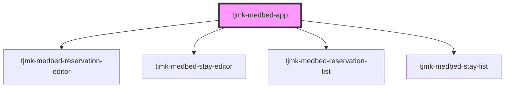

# tjmk-medbed-app

<!-- Auto Generated Below -->

## Properties

| Property       | Attribute       | Description | Type     | Default     |
| -------------- | --------------- | ----------- | -------- | ----------- |
| `apiBase`      | `api-base`      |             | `string` | `undefined` |
| `basePath`     | `base-path`     |             | `string` | `''`        |
| `departmentId` | `department-id` |             | `string` | `undefined` |

## Dependencies

### Depends on

- [tjmk-medbed-reservation-editor](../tjmk-medbed-reservation-editor)
- [tjmk-medbed-stay-editor](../tjmk-medbed-stay-editor)
- [tjmk-medbed-reservation-list](../tjmk-medbed-reservation-list)
- [tjmk-medbed-stay-list](../tjmk-medbed-stay-list)

### Graph

----------------------------------------------

*Built with [StencilJS](https://stenciljs.com/)*
